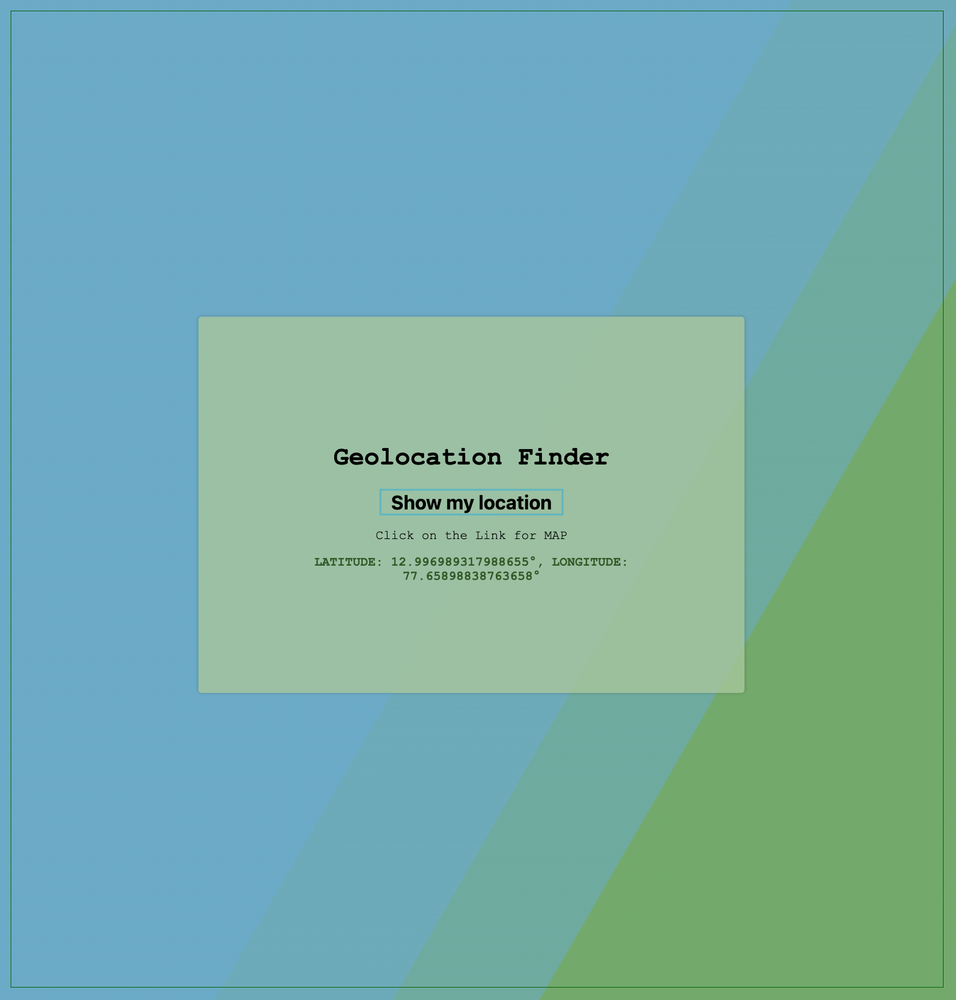

# GeoLocation Finder

## Table of Contents

- [GeoLocation Finder](#geolocation-finder)
  - [Table of Contents](#table-of-contents)
  - [About ](#about-)

## About 

Get Location through navigator.geolocation

